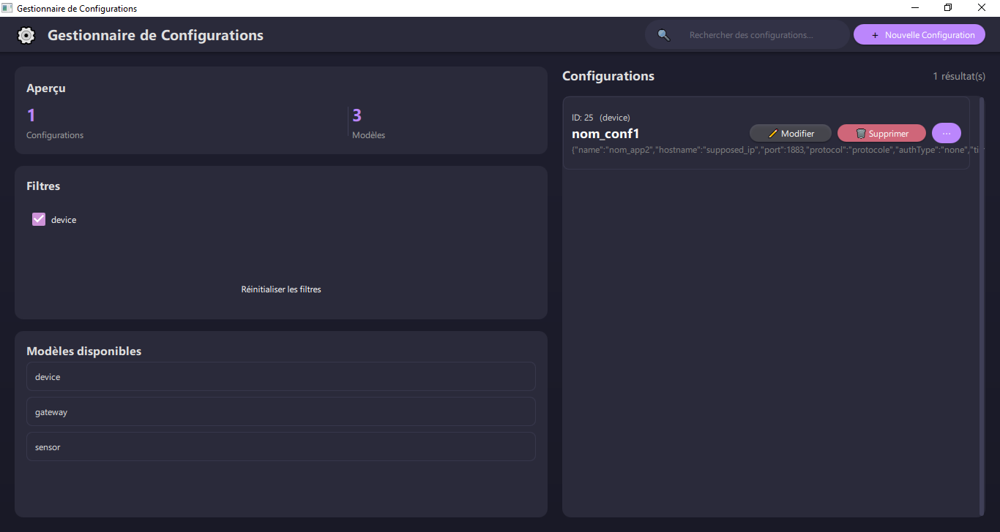
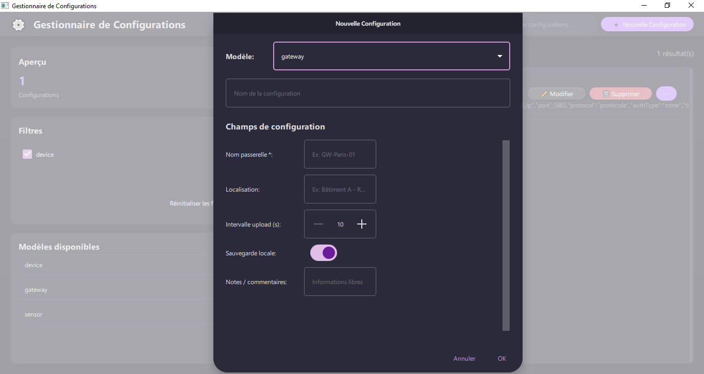

# Nexus

A modern Qt application for managing and organizing equipment configurations with an intuitive template-based system.


## ✨ Features

- 🎨 **Modern Dark Theme** - Clean Material Design interface
- 📝 **Template-Based System** - Predefined templates for sensors, devices, and gateways
- 🔍 **Advanced Search & Filtering** - Real-time search with type-based filtering
- 💾 **Local SQLite Database** - No external dependencies, works offline
- ⚙️ **Fully Customizable** - JSON-based template system for custom configurations
- 📊 **Real-time Statistics** - Live overview of configurations and templates
- 🚀 **Cross-Platform** - Runs on Windows, macOS, and Linux

## 🖼️ Screenshots

*Main Interface mockup*
```
┌─────────────────────────────────────────────────────────────────┐
│ ⚙️ Configuration Manager          🔍 [Search...]  [New Config] │
├─────────────────┬───────────────────────────────────────────────┤
│ Overview        │ Configurations                                │
│ • 42 Configs    │ ┌─────────────────────────────────────────┐   │
│ • 3 Templates   │ │ ID: 1 (sensor)                          │   │
│                 │ │ Temperature Sensor A1                   │   │
│ Filters         │ │ {"name":"Temp-A1","rate":10,"unit":"°C"}│   │
│ ☑ sensor        │ │                    [Edit] [Delete] [⋯] │   │
│ ☑ device        │ └─────────────────────────────────────────┘   │
│ ☑ gateway       │ ┌─────────────────────────────────────────┐   │
│                 │ │ ID: 2 (device)                          │   │
│ Templates       │ │ Gateway Main                            │   │
│ • sensor        │ │ {"hostname":"192.168.1.10","port":1883} │   │
│ • device        │ │                    [Edit] [Delete] [⋯] │   │
│ • gateway       │ └─────────────────────────────────────────┘   │
└─────────────────┴───────────────────────────────────────────────┘
```
*Main Interface*  


*Add New Configuration*  


## 🚀 Quick Start

### Prerequisites
- Qt 6.8 or higher
- CMake 3.16+
- C++17 compatible compiler

### Installation

#### Option 1: Download Release
1. Download the latest release from the [Releases](../../releases) page
2. Extract and run the executable
3. The application will create a local database on first launch

#### Option 2: Build from Source

**Linux / macOS (bash)**

```bash
# Clone the repository
git clone https://github.com/med1001/Nexus.git
cd Nexus

# Clean previous build state
rm -rf build

# Configure (use the path to your Qt6 CMake files)
cmake -B build -S . -G Ninja -DCMAKE_PREFIX_PATH="/path/to/Qt/6.x.x/<toolchain>/lib/cmake/Qt6"

# Build
cmake --build build

# Run
./build/appconfigurationManager
```

> Set `/path/to/Qt/6.x.x/<toolchain>` to the Qt installation that contains `Qt6Config.cmake` (the directory that contains `lib/cmake/Qt6`).

---

**Windows (PowerShell) — MinGW + Ninja (as used for this project)**

```powershell
# Clone the repository
git clone https://github.com/med1001/Nexus.git
Set-Location .\Nexus

# Add MinGW compiler & Ninja to PATH for this session
$env:Path += ";C:\Qt\Tools\mingw1310_64\bin;C:\Qt\Tools\Ninja"

# Remove any previous build to avoid generator conflicts
Remove-Item -Recurse -Force build -ErrorAction SilentlyContinue

# Configure CMake (point to the Qt6 CMake files)
cmake -B build -G "Ninja" -S . -DCMAKE_PREFIX_PATH="C:\Qt\6.9.1\mingw_64\lib\cmake\Qt6"

# Build
cmake --build build

# Ensure Qt runtime DLLs and plugins are available for the running process
$env:Path += ";C:\Qt\6.9.1\mingw_64\bin"
$env:QT_PLUGIN_PATH = "C:\Qt\6.9.1\mingw_64\plugins"

# Run the application
Set-Location .\build
.\appconfigurationManager.exe
```

If the executable exits immediately, ensure the `Path` and `QT_PLUGIN_PATH` lines above are executed in the same session before launching; they allow the app to find Qt DLLs and the `platforms` plugin (e.g., `qwindows.dll`).


## 🎯 Basic Usage

### Creating a Configuration
1. Click **"New Configuration"** in the header
2. Select a template (Sensor, Device, or Gateway)
3. Fill in the required fields
4. Click **"OK"** to save

### Managing Configurations
- **Edit**: Click the ✏️ button to modify existing configurations
- **Delete**: Click the 🗑 button to remove configurations
- **View Details**: Click the ⋯ button to see full JSON data

### Search and Filter
- **Search**: Type in the search bar to find configurations by name
- **Filter by Type**: Use checkboxes in the sidebar to filter by configuration type
- **Reset**: Click "Reset Filters" to clear all filters

## 📋 Built-in Templates

| Template | Purpose | Key Fields |
|----------|---------|------------|
| **Sensor** | Environmental sensors | Name, Model, Frequency, Unit, Precision |
| **Device** | Network devices | Name, Hostname, Port, Protocol, Authentication |
| **Gateway** | Communication gateways | Name, Location, Upload Interval, Backup Settings |

## ⚙️ Customization

The application uses a flexible JSON-based template system. You can customize templates by modifying the `templates.json` file:

```json
{
  "type": "custom_device",
  "version": 1,
  "title": "Custom Device Configuration",
  "fields": [
    {
      "id": "device_name",
      "label": "Device Name",
      "type": "string",
      "required": true
    },
    {
      "id": "power_level",
      "label": "Power Level",
      "type": "int",
      "min": 0,
      "max": 100,
      "default": 50
    }
  ]
}
```

## 📁 Project Structure

```
configurationManager/
├── CMakeLists.txt              # Build configuration
├── main.cpp                    # Application entry point
├── Main.qml                    # Main UI interface
├── ConfigurationModel.[h|cpp]  # Database model
├── TemplateManager.[h|cpp]     # Template system
├── templates.json              # Template definitions
└── resources.qrc              # Qt resources
```

## 🔧 Development

### Architecture
- **Backend**: C++ with Qt6 (Model layer)
- **Frontend**: QML with Material Design
- **Database**: SQLite for local storage
- **Templates**: JSON-based configuration system

### Key Components
- **ConfigurationModel**: SQLite interface with QML integration
- **TemplateManager**: JSON template loading and validation
- **Main.qml**: Responsive UI with search/filter capabilities

For detailed development information, see the [Developer Documentation](docs/developer-documentation.md).

## 📚 Documentation

- **[User Manual](docs/user-manual.md)** - Complete usage guide
- **[Developer Documentation](docs/developer-documentation.md)** - Technical details and API reference
- **[Template System Guide](docs/user-manual.md#template-system)** - How to customize templates

## 🤝 Contributing

Contributions are welcome! Please feel free to submit a Pull Request. For major changes, please open an issue first to discuss what you would like to change.

By contributing to this project, you agree that your contributions will be licensed under the GNU General Public License v3.0.

### Development Setup
1. Fork the repository
2. Create your feature branch (`git checkout -b feature/amazing-feature`)
3. Commit your changes (`git commit -m 'Add some amazing feature'`)
4. Push to the branch (`git push origin feature/amazing-feature`)
5. Open a Pull Request

## 🐛 Issues

If you encounter any problems:
1. Check the [User Manual](docs/user-manual.md#troubleshooting) troubleshooting section
2. Search existing [issues](../../issues)
3. Create a new issue with detailed information about the problem

## 📄 License

This project is licensed under the GNU General Public License v3.0 - see the [LICENSE](LICENSE) file for details.

This program is free software: you can redistribute it and/or modify it under the terms of the GNU General Public License as published by the Free Software Foundation, either version 3 of the License, or (at your option) any later version.

This program is distributed in the hope that it will be useful, but WITHOUT ANY WARRANTY; without even the implied warranty of MERCHANTABILITY or FITNESS FOR A PARTICULAR PURPOSE. See the GNU General Public License for more details.

## 🙏 Acknowledgments

- Built with [Qt](https://www.qt.io/) framework
- UI inspired by Material Design principles
- SQLite for reliable local data storage

---

**⭐ Star this repository if you find it useful!**
